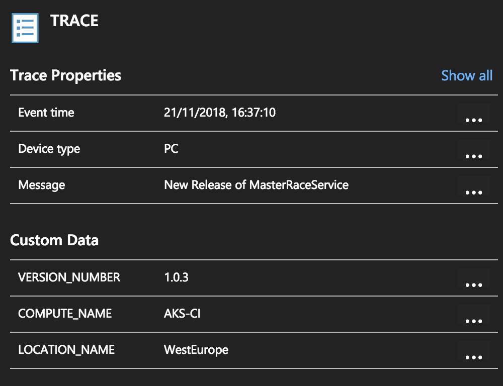

# notify-deployment-appinsights

This tool will notify that you have made a deployment to application insights. 
It's intended to work in your pipeline as a container, and in a central application insights where you can easily query and correlate all your deployments.

It will read values from your Environment Variables.

# Environment Variables you'll need:

`INSTRUMENTATION_KEY`: Instrumentation Key of Application Insights.
`SERVICE_NAME`: Name of the service being deployed.

# Custom Properties that you can add:

`LOCATION_NAME`: Where you are deploying (WestEurope, WestUS, SouthEastAsia...)
`COMPUTER_NAME`: Where is this app being hosted
`VERSION_NUMBER`: Version of your service


Example of usage:

```
docker build -t appi .
docker run -ti -e INSTRUMENTATION_KEY=b96ae344-8f7a-41d4-9546-26ed29016182 -e SERVICE_NAME=MasterRaceService -e LOCATION_NAME=WestEurope -e COMPUTE_NAME=AKS-CI -e VERSION_NUMBER=1.0.3 appi
```

Your event will be registered as:

